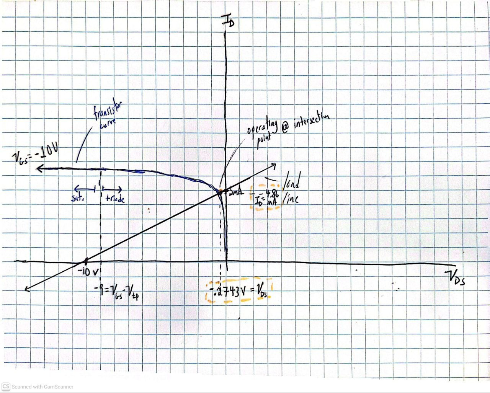

# Floating Node Supplementary Content
## Table of Contents

-Semiconductors(#semiconductors)
  - [Can You Find the Operating Point of this PMOS?](#can-you-find-the-operating-point-of-this-pmos?)

    
## Semiconductors
A collection of supplmentary materials to Floating Node content on smiconductors problems

### Can You Find The Operating Point of this PMOS?

In the last minute of my video, my graphical display of the operating point was out of view so here is an image that can be understood in the context of what was taught. I'll be more mindful of my camera angles next time!

